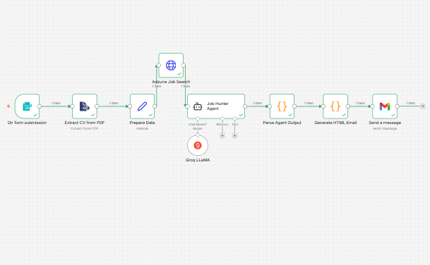

# Smart Job Hunter + Cover Letter Generator

An end-to-end AI-powered job hunting automation workflow built with n8n, Groq LLaMA, and Adzuna API.

## What It Does

1. User submits a form with their CV (PDF) and job preferences
2. CV text is extracted from the PDF
3. Real job listings are fetched from Adzuna API based on job type and location
4. LLaMA 3.3-70b (via Groq) analyzes the CV against the listings and picks the best match
5. A personalized cover letter is generated for that job
6. Results are delivered to the user's email via Gmail

## Architecture

Form Trigger → PDF Extraction → Data Preparation → Adzuna Job Search (HTTP) → LLM Agent (Groq LLaMA 3.3-70b) → JSON Parser → HTML Email Builder → Gmail Send

## Tech Stack

- **Workflow Orchestration**: n8n (self-hosted)
- **LLM**: LLaMA 3.3-70b-versatile via Groq API (free tier)
- **Job Search**: Adzuna API (free tier)
- **Email Delivery**: Gmail via OAuth2
- **PDF Parsing**: n8n native PDF extractor

## Why Free APIs Only

This workflow was intentionally built using only free-tier APIs:
- Groq replaces Gemini (no cost, faster inference)
- Adzuna replaces SerpAPI (no cost, legitimate job data)

## Setup

### Prerequisites
- n8n self-hosted instance
- Groq API key (free at console.groq.com)
- Adzuna API credentials (free at developer.adzuna.com)
- Gmail OAuth2 credential configured in n8n

### Steps
1. Import `job_search_modified.json` into your n8n instance
2. Add your Groq API key as a credential in the Groq LLaMA node
3. Connect your Gmail OAuth2 credential to the Send a message node
4. Activate the workflow
5. Open the form URL generated by n8n and submit your CV

## Form Fields

| Field | Required | Description |
|---|---|---|
| CV/Resume (PDF) | Yes | Your resume in PDF format |
| Preferred Location | Yes | City or Remote |
| Country Code | Yes | e.g. in, us, gb |
| Job Type | Yes | Full Time, Part Time, Internship etc |
| Work Setting | Yes | On Site, Remote, Hybrid |
| Adzuna App ID | Yes | From developer.adzuna.com |
| Adzuna App Key | Yes | From developer.adzuna.com |
| Email | Yes | Where results will be sent |

## Output

The user receives an HTML email containing:
- Candidate profile summary extracted from CV
- Best matching job with apply link
- Personalized cover letter (250-350 words)
- Application tips

## Limitations

- One job match per run by design
- Adzuna free tier has rate limits
- Groq free tier has rate limits (returns 429 if exceeded)
